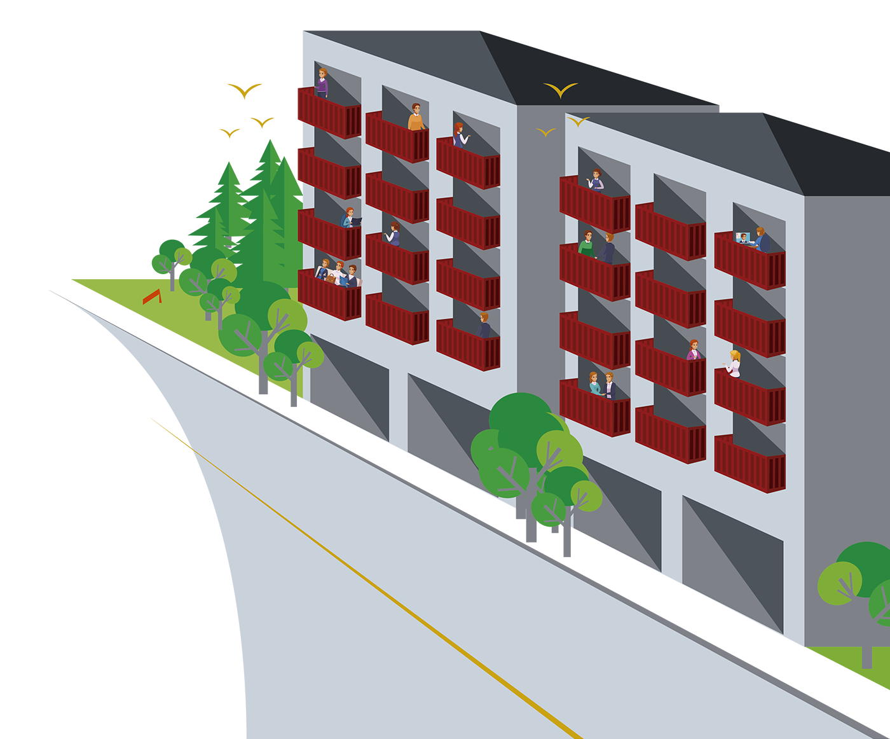

<!--
*** Thanks for checking out this README Template. If you have a suggestion that would
*** make this better, please fork the repo and create a pull request or simply open
*** an issue with the tag "enhancement".
*** Thanks again! Now go create something AMAZING! :D
***
***
***
*** To avoid retyping too much info. Do a search and replace for the following:
*** rafaelbogfreitas, repo, twitter_handle, email
-->


<!-- PROJECT SHIELDS -->
<!--
*** I'm using markdown "reference style" links for readability.
*** Reference links are enclosed in brackets [ ] instead of parentheses ( ).
*** See the bottom of this document for the declaration of the reference variables
*** for contributors-url, forks-url, etc. This is an optional, concise syntax you may use.
*** https://www.markdownguide.org/basic-syntax/#reference-style-links
-->
[![Contributors][contributors-shield]][https://github.com/rafaelbogfreitas/projeto_2/graphs/contributors]
[![Issues][issues-shield]][https://github.com/rafaelbogfreitas/projeto_2/issues]
[![LinkedIn][linkedin-shield]][https://www.linkedin.com/in/rafaelborgesfreitas/]


<!-- PROJECT LOGO -->
<br />
<p align="center">
  <a href="https://github.com/rafaelbogfreitas/projeto_2">
    
  </a>

  <h3 align="center">Sacada do Prédio</h3>

  <p align="center">
    Help people in your community
    <br />
    <a href="https://github.com/rafaelbogfreitas/projeto_2"><strong>Explore the docs »</strong></a>
    <br />
    <br />
    <a href="https://sacadadopredio.com">View Demo</a>
    ·
    <a href="https://github.com/rafaelbogfreitas/projeto_2/issues">Report Bug</a>
    ·
    <a href="https://github.com/rafaelbogfreitas/projeto_2/issues">Request Feature</a>
  </p>
</p>


<!-- TABLE OF CONTENTS -->
## Table of Contents

* [About the Project](#about-the-project)
  * [Built With](#built-with)
* [Getting Started](#getting-started)
  * [Prerequisites](#prerequisites)
  * [Installation](#installation)
* [Usage](#usage)
* [Contact](#contact)
* [Acknowledgements](#acknowledgements)


<!-- ABOUT THE PROJECT -->
## About The Project


Boa tarde pessoal. Queria compartilhar com vocês um projeto que venho trabalhando com um amigo meu do bootcamp nas últimas duas semanas, o Sacada do Prédio.

A ideia do nome veio dos vários exemplos de pessoas reunidas nas sacadas (ou varandas) em meio ao distanciamento social causado pela pandemia de coronavirus.

Da sacada do prédio nos confraternizamos com vizinhos e familiares, mas também podemos ver de perto as necessidades da nossa comunidade. A pergunta é: Como podemos ajudar?

A ideia é criar uma plataforma onde os usuários podem cadastrar "Casos", ou necessidades, de modo que as pessoas ao redor possam ajudá-lo ou contribuir com a sua causa.

Ao completar o cadastro você terá acesso aos casos da sua região, podendo entrar em contato com o responsável pelo caso.

Quando um novo caso é criado todos os usuários que estão próximos àquele caso são notificados por email e podem entrar em contato para ajudar.

Estamos em fase de testes, então por favor dêem uma olhada e mandem os seus feedbacks (podem utilizar a bolinha vermelha no canto inferior direito pra mandar feebakcs).

Muito obrigado!

Daniel Paiva.

### Built With

* [Bootstrap](https://getbootstrap.com) - used to whatever test
* [JQuery](https://jquery.com)
* [Laravel](https://laravel.com)


<!-- GETTING STARTED -->
## Getting Started

To get a local copy up and running follow these simple steps.


### Prerequisites

This is an example of how to list things you need to use the software and how to install them.
* npm
```sh
npm install npm@latest -g
```

### Installation
 
1. Clone the repo
```sh
git clone https://github.com/rafaelbogfreitas/projeto_2.git
```
2. Install NPM packages
```sh
npm install
```


<!-- USAGE EXAMPLES -->
## Usage

Use this space to show useful examples of how a project can be used. Additional screenshots, code examples and demos work well in this space. You may also link to more resources.

_For more examples, please refer to the [Documentation](https://example.com)_


<!-- ROADMAP -->
## Roadmap

See the [open issues](https://github.com/rafaelbogfreitas/projeto_2/issues) for a list of proposed features (and known issues).


<!-- CONTRIBUTING -->
## Contributing

Contributions are what make the open source community such an amazing place to be learn, inspire, and create. Any contributions you make are **greatly appreciated**.

1. Fork the Project
2. Create your Feature Branch (`git checkout -b feature/AmazingFeature`)
3. Commit your Changes (`git commit -m 'Add some AmazingFeature'`)
4. Push to the Branch (`git push origin feature/AmazingFeature`)
5. Open a Pull Request


<!-- CONTACT -->
## Contact

Daniel Paiva - [@twitter_handle](https://twitter.com/danielcspaiva) - danielcspaiva@gmail.com

Project Link: [https://github.com/rafaelbogfreitas/projeto_2](https://github.com/rafaelbogfreitas/projeto_2)


<!-- ACKNOWLEDGEMENTS -->
## Acknowledgements

* []()
* []()
* []()


<!-- MARKDOWN LINKS & IMAGES -->
<!-- https://www.markdownguide.org/basic-syntax/#reference-style-links -->
[contributors-shield]: https://img.shields.io/github/contributors/othneildrew/Best-README-Template.svg?style=flat-square
[contributors-url]: https://github.com/othneildrew/Best-README-Template/graphs/contributors
[forks-shield]: https://img.shields.io/github/forks/othneildrew/Best-README-Template.svg?style=flat-square
[forks-url]: https://github.com/othneildrew/Best-README-Template/network/members
[stars-shield]: https://img.shields.io/github/stars/othneildrew/Best-README-Template.svg?style=flat-square
[stars-url]: https://github.com/othneildrew/Best-README-Template/stargazers
[issues-shield]: https://img.shields.io/github/issues/othneildrew/Best-README-Template.svg?style=flat-square
[issues-url]: https://github.com/othneildrew/Best-README-Template/issues
[license-shield]: https://img.shields.io/github/license/othneildrew/Best-README-Template.svg?style=flat-square
[license-url]: https://github.com/othneildrew/Best-README-Template/blob/master/LICENSE.txt
[linkedin-shield]: https://img.shields.io/badge/-LinkedIn-black.svg?style=flat-square&logo=linkedin&colorB=555
[linkedin-url]: https://linkedin.com/in/othneildrew
[product-screenshot]: images/screenshot.png