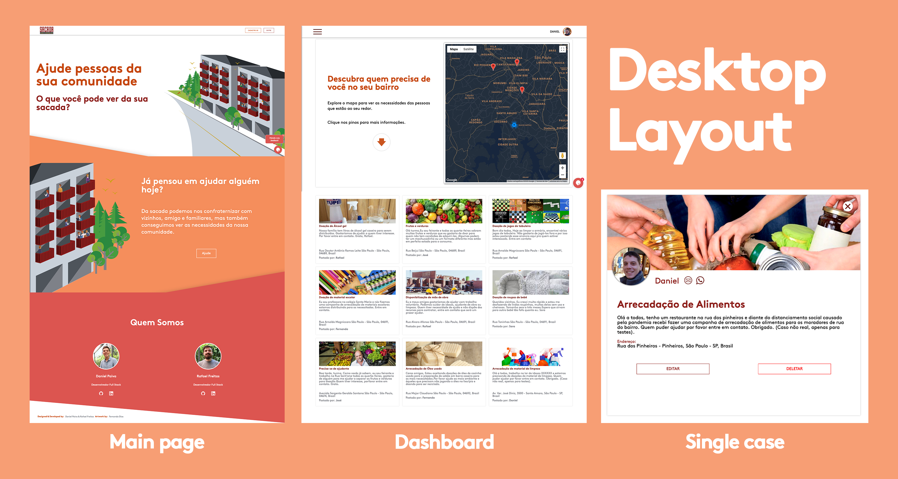
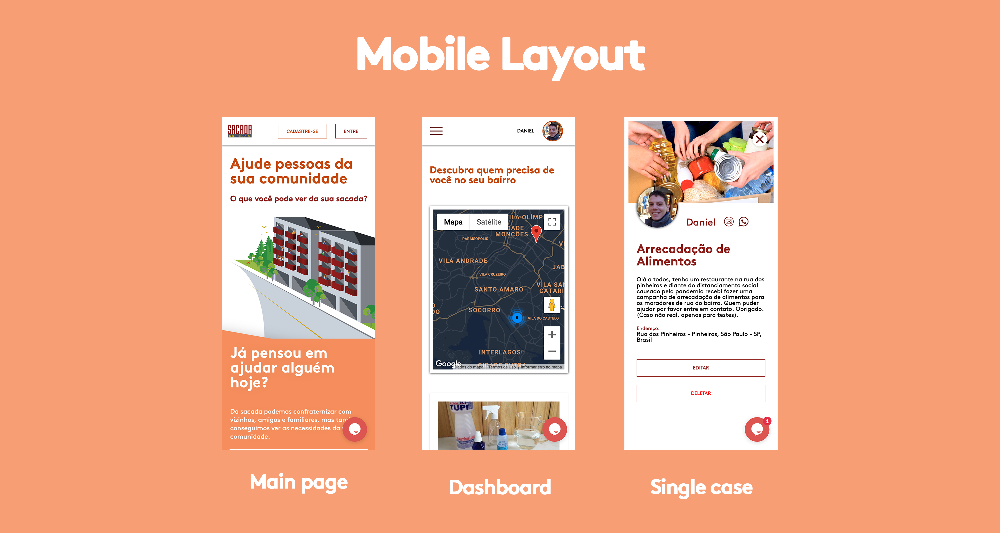

# Sacada do Prédio
#### TLDR: http://www.sacadadopredio.com/


## About The Project

The coronavirus pandemic changed the way we function as a society. The social distancing we had to undergo brougth back a sense of community that had been partially lost. Scenes of people gathering in their balconies with their family and neighbours became very common, as well as the problems the communities around the globe started facing due to the pandemic. In face of this situation we decided to create Sacada do Prédio.

Sacada do Prédio is a web application where people can post their needs and other users from their community can help. The idea for the name came from the gatherings in the balconies (Sacada in portuguese). Our balconies are places where we can hang out and connect with people, but they also provide us with a view of our neighbourhood. Why not use it to better understant and help the people of our community?

Our goal is to provide a platform where users can register and post new cases. Whenever a new case is posted, all users within that area are notified so that they can volunteer to help. The users can also see the cases in their community either in a map view or card view.

### Built With:

* [NodeJS](https://nodejs.org/en/) - JavaScript runtime Server.
* [Express](https://expressjs.com/pt-br/) - Web framework.
* [Handlebars](https://handlebarsjs.com/) - View Engine.
* [MongoDB](https://www.mongodb.com/) - NoSQL Database.
* [Mongoose](https://mongoosejs.com/) - MongoDB object modeling for Node.js.
* [Axios](https://github.com/axios/axios) - Promise based HTTP client for the browser and Node.js.
* [Bcrypt](https://www.npmjs.com/package/bcrypt) - A library to help you hash passwords.
* [Passport](http://www.passportjs.org/) - Simple, unobtrusive authentication for Node.js.
* [Claudinary](https://cloudinary.com/) - Platform for storing images.
* [Nodemailer](https://nodemailer.com/about/) - Automatic email sending via Node.js.
* [Google OAuth](https://developers.google.com/identity/protocols/oauth2) - User authentication via Google account.
* [Google Maps Api](https://developers.google.com/?hl=pt-br) - Google Maps and address autocomplete.
* [Hotjar](https://www.hotjar.com/) - Website behavior analytics.
* [Tawk.to](https://www.tawk.to/) - Live chat solution for support on our website.
* [Heroku](https://www.heroku.com/) - Cloud platform where the project is deployed.


<!-- GETTING STARTED -->
## Getting Started

The application UI consists in three main views:

* Main page - Information about the project.
* Dashboard - Dashboard where the user can see the cases nearby on a map or in the cards below.
* Single case - This is where the user can see the details of a single case and get contact information of the user who registered the case.

The views are illustrated in the screenshots below for desktop and mobile devices:





### Prerequisites

In order to run this project locally you will need to:

* Setup Google API keys for Google Maps and OAuth.
* Setup Cloudinary API keys.
* Setup MongoDB locally or on the cloud.
* Install Node.js.


### Installation

1. Clone the repo
```sh
git clone https://github.com/rafaelbogfreitas/projeto_2.git
```
2. Install NPM packages
```sh
npm install
```
3. Run the app
```sh
npm start
```
Or run with Nodemon
```sh
npm run dev
```

<!-- USAGE EXAMPLES -->
## Usage

The project is deployed and can be accessed at http://www.sacadadopredio.com/


<!-- CONTRIBUTING -->
## Contributing

Contributions are what make the open source community such an amazing place to learn, inspire, and create. Any contributions you make are **greatly appreciated**.

1. Fork the Project
2. Create your Feature Branch
```sh
git checkout -b feature/AmazingFeature
```
3. Commit your Changes
```sh
git commit -m 'Add some AmazingFeature'
```
4. Push to the Branch
```sh
git push origin feature/AmazingFeature
```
5. Open a Pull Request


<!-- CONTACT -->
## Contact

Daniel Paiva - [twitter](https://twitter.com/danielcspaiva) - [email](mailto:danielcspaiva@gmail.com) - [linkedin](https://www.linkedin.com/in/danielcspaiva/)

Rafael Freitas - ......


<!-- ACKNOWLEDGEMENTS -->
## Special thanks

* [Joc](https://github.com/jocnjr/library-project-7/commits?author=jocnjr) - Lead Teacher at [Ironhack São Paulo.](https://www.ironhack.com/br)
* [Vini](https://github.com/vinivibe) - Teaching assistant at [Ironhack São Paulo.](https://www.ironhack.com/br)
* [Mônica](https://github.com/mdccbranco) - Teaching assistant at [Ironhack São Paulo.](https://www.ironhack.com/br)
* [Grazi](https://github.com/grazidiandra) - Teaching assistant at [Ironhack São Paulo.](https://www.ironhack.com/br)